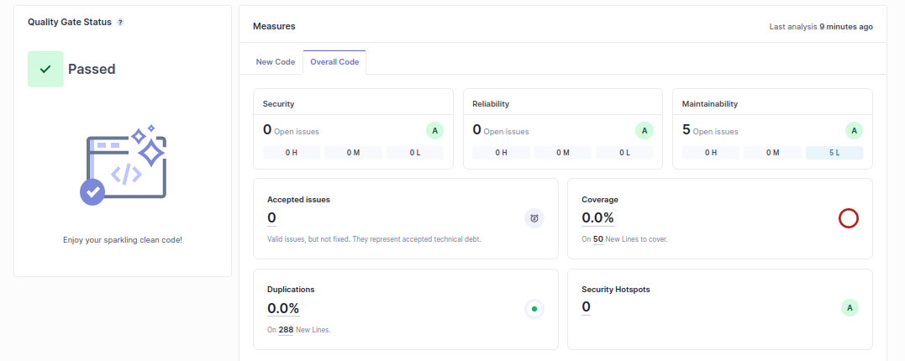
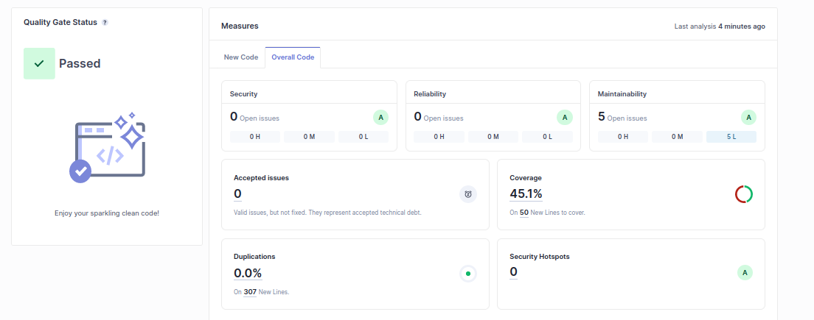
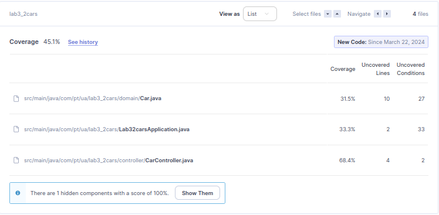
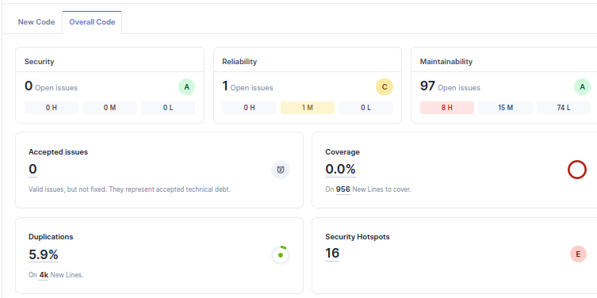
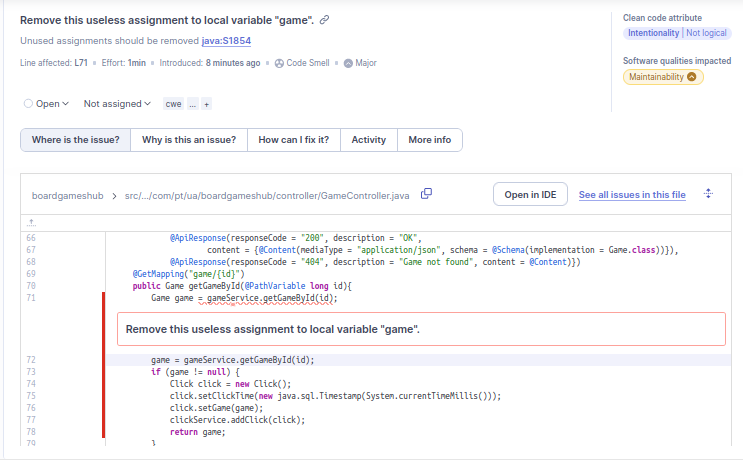
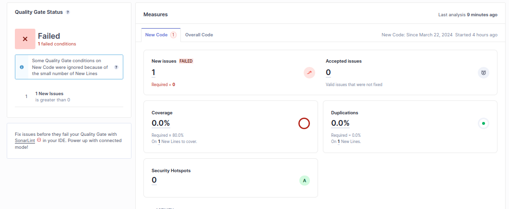
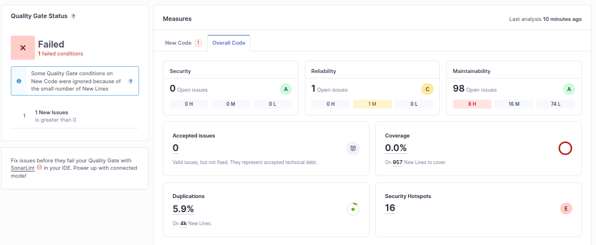

## 6.1

e) O projeto passou o quality gate. Teve 30 issues de Maintainability, das quais 9 foram de impacto médio e 21 de imapcto baixo. O coverage foi de 79.2% e as duplicação ficou a 0%. Foi encnotrado um security hotspot, referente a geração de números pseudoaleatórios na classe Dip.

f) 
| Issue              | Problem Description                                                                                                                                                                                                                                                                                                  | How to solve                                                                                                                                                                                                                                                                               |
|--------------------|----------------------------------------------------------------------------------------------------------------------------------------------------------------------------------------------------------------------------------------------------------------------------------------------------------------------|--------------------------------------------------------------------------------------------------------------------------------------------------------------------------------------------------------------------------------------------------------------------------------------------|
| Security Hotspot   | When software generates predictable values in a context requiring unpredictability, it may be possible for an attacker to guess the next value that will be generated, and use this guess to impersonate another user or access sensitive information.                                                               | Use a cryptographically strong random number generator (RNG) like "java.security.SecureRandom" in place of this PRNG; Use the generated random values only once; You should not expose the generated random value. If you have to store it, make sure that the database or file is secure. |
| Code smell (major) | Passing message arguments that require further evaluation into a Guava  com.google.common.base.Preconditions  check can result in a performance penalty. That is because whether or not they’re needed, each  argument must be resolved before the method is actually called.                                        | Instead, you should structure your code to pass static or pre-computed values into Preconditions conditions check and logging calls.                                                                                                                                                       |
| Code smell (major) | A for loop termination condition should test the loop counter against an invariant value that does not change during the execution of the loop. Invariant termination conditions make the program logic easier to understand and maintain. In this case: the loop counters are updated in the body of the  for loop. | If the counter variable must be updated in the loop’s body, use a while or do while loop instead of a for loop.                                                                                                                                                                            |
| Code smell (major) | Testing equality or nullness with JUnit’s assertTrue() or assertFalse() should be simplified to the corresponding dedicated assertion.                                                                                                                                                                               | Use AssertEquals instead.                                                                                                                                                                                                                                                                  |

## 6.2

a) Technical debt: 10 minutes. O technical debt dá uma estimativa do tempo necessário que o programador levará para resolver as issues encontradas.

b) Apenas 5 issues com low impact (minor code smell) foram enontradas, todas relacionadas a ter "public" nas classes de testes.

c) 

## 6.3

a) Novo Quality Gate: baseado no default, optei por mudar apenas a porcentagem permitida de código duplicado para 0, por achar que é um problema grave e simples de resolver em sua totalidade.

b) Foi introduzido um novo bad smell (useless assignment) no GameController. Foi identificado pelo Sonarqube:

O novo código (1 linha) não passou o qualityGate:

Na dashboard do overall code, é possível ver que o número de issues aumentou 1 valor, como era esperado.

 
